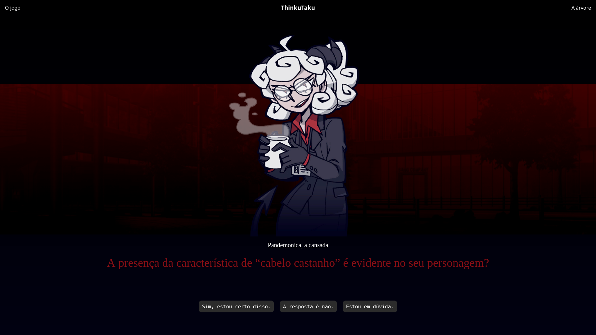

<h1 align="center">
  <br>
  <a href="https://github.com/akaTsunemori/ThinkuTaku"></a>
  <br>
  ThinkuTaku
  <br>
</h1>

<h4 align="center">Afinal, por que não colocar demônias para adivinhar o personagem de anime em que você está pensando?</h4>

<p align="center">
  <a href="#funcionalidades">Funcionalidades</a> •
  <a href="#roadmap">Roadmap</a> •
  <a href="#instalação">Instalação</a> •
  <a href="#como-usar">Como usar</a> •
  <a href="#créditos">Créditos</a> •
  <a href="#licença">Licença</a>
</p>



## Funcionalidades

* Árvore de decisão criada dinamicamente
  - A partir de um dataset, a árvore é gerada em tempo de execução
* Estrutura da árvore de decisão
  - A estrutura da árvore pode ser vista de modo amigável ao usuário pelo próprio software
* Personagens
  - As personagens deixam mais divertido o processo de perguntas e respostas
* Interações
  - As personagens interagem com você durante a adivinhação
* Estética
  - O software tem uma estética chamativa, prendendo a sua atenção :)

## Roadmap

Lista com o progresso do software

- [x] Elaboração do dataset
- [x] Arquitetura da DecisionTree
- [x] Implementação da DecisionTree
- [x] Implementação da lógica de perguntas e respostas
- [x] Implementação de módulos adicionais para gerenciar diálogos e assets
- [x] Estilização da interface
- [x] Polimento e detalhes finais
- [ ] Otimizações para a DecisionTree

## Instalação

Para clonar e executar o website, será necessário que as tecnologias [Git](https://git-scm.com), [Python](https://www.python.org/) e [pip](https://pip.pypa.io/en/stable/index.html) estejam instaladas em seu computador, além de um browser capaz de JavaScript. Os seguintes comandos devem ser executados em um Terminal:

```bash
# Clonar este repositório
git clone https://github.com/akaTsunemori/ThinkuTaku.git

# Mudar o diretório corrente ao do repositório
cd ThinkuTaku

# Criar ambiente conteinerizado
python3 -m venv venv

# Ativar o ambiente criado
source ./venv/bin/activate

# Instalar dependências
pip install -r requirements.txt

# Executar a aplicação
python3 app.py
```

> **Notas:**<br>
> - As instruções acima foram direcionadas a um ambiente Linux;<br>
> - Para desativar o ambiente virtual criado, apenas digite **deactivate** em seu terminal;<br>
> - Refira-se a https://docs.python.org/3/library/venv.html para mais informações sobre ambientes virtuais em Python.

## Como usar

Para acessar o website, basta abrir um browser qualquer (Firefox ou Chrome, por exemplo) e se direcionar ao site *localhost:5000*.
O uso do sistema é intuitivo, contendo apenas três botões na tela inicial: *"O jogo"*, *"A Árvore"* e *"Vamos jogar."* que, respectivamente,
direcionam para a tela inicial, a tela com a estrutura da árvore e a tela para começar um novo jogo.

## Créditos

Esse software usa os seguintes módulos de código aberto:

- [Flask](https://flask.palletsprojects.com/en/2.3.x/)
- [pandas](https://pandas.pydata.org/)
- [deep-translator](https://pypi.org/project/deep-translator/)
- [NumPy](https://numpy.org/)
- [scikit-learn](https://scikit-learn.org/stable/index.html)

Esse software usou sprites do jogo Helltaker:
- [Helltaker](https://store.steampowered.com/app/1289310/Helltaker/)

## Licença

Licensed under the BSD 3-Clause Clear License<br>

---

Esse é um projeto sem fins comerciais, seu único propósito é
a aplicação de conhecimentos obtidos na matéria de Projeto e Análise de Algoritmos,
ministrada pelo professor Jan Medonça Correa, na Universidade de Brasília.

---

> GitHub [@akaTsunemori](https://github.com/akaTsunemori)<br>
> GitHub [@victorandre957](https://github.com/victorandre957)<br>
> GitHub [@tlamen](https://github.com/tlamen)<br>
> GitHub [@enz03](https://github.com/enz03)<br>
> GitHub [@allmeidaapedro](https://github.com/allmeidaapedro)<br>
